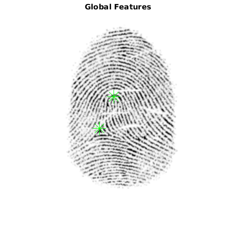
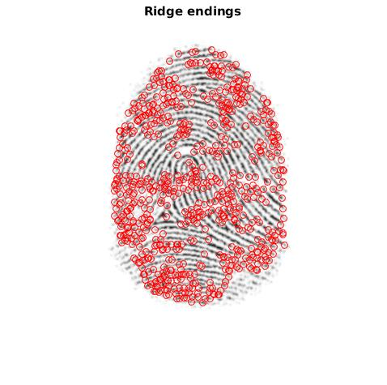
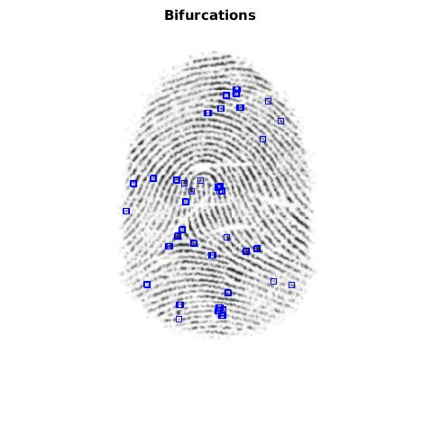

# Fingerprint Analysis &ndash; Preprocessing and Feature Extraction

- Keywords: Biometrics, Computer Vision, Image Processing
- Technology: MathWorks&reg; MATLAB&trade; with Image Processing Toolbox
- [Report](https://www.slideshare.net/RolandBruggmann/merkmalsextraktion-am-fingerabdruck) on SlideShare
- [Project](https://ch.mathworks.com/matlabcentral/fileexchange/69424-fingerprint-analysis-preprocessing-and-feature-extraction) on MathWorks&reg; File Exchange

---

 *Fig.: Global Features, Ridge Endings and Bifurcations*

---

## Description

Nowadays, digital authentication usually takes place via a user account, consisting of user name and password. When a user name is entered, an identity is propagated and the password is used for verification. However, stronger security is offered by biometric methods. A person provides a sample for identification and the sample is compared with the reference data in the system.

An important physiological attribute of a natural person is his fingerprint which can serve as a measurable identifier. For this purpose, the impression must undergo an analysis so that characteristic features can be extracted and compared. With this live script we want to implement algorithms of known methods of biometrics for feature extraction at the fingerprint.

Verification with physiological methods in biometry consists of five steps as follows:

1. Capture: Capture the digital sample
2. Extraction: Preprocess and extraction of characteristics
3. Template creation: Creating a structured template according to the system
4. Query template database: Comparison of the template with the reference template in the system, vector as result
5. Compare matching: Evaluation of the vector, result positive or negative

In civil applications such as smartphones and laptops, a digital sample is in most cases acquired using a sweep sensor. The pre-processing and extraction of the characteristics are carried out using digital image processing methods. Finally, the local coordinates of the characteristics serve as a template, both for the initial acquisition and for the samples. Finally, the template is compared with the reference data. The resulting vector is evaluated using statistical methods.

For this challenge we focus on the second step: Preprocess and extraction of characteristics by the gradient based method of [Bazen/Gerez, 2002]. Further the Image Processing Toolbox from MathWorks&reg; is used for image processing. The raw image is a fingerprint from a database of [FVC, 2004].

## Cite As

Roland Bruggmann (2016). *Fingerprint Analysis - Preprocessing and Feature Extraction.* GitHub. URL: [https://github.com/brugr9/fipa/](https://github.com/brugr9/fipa/)

---
